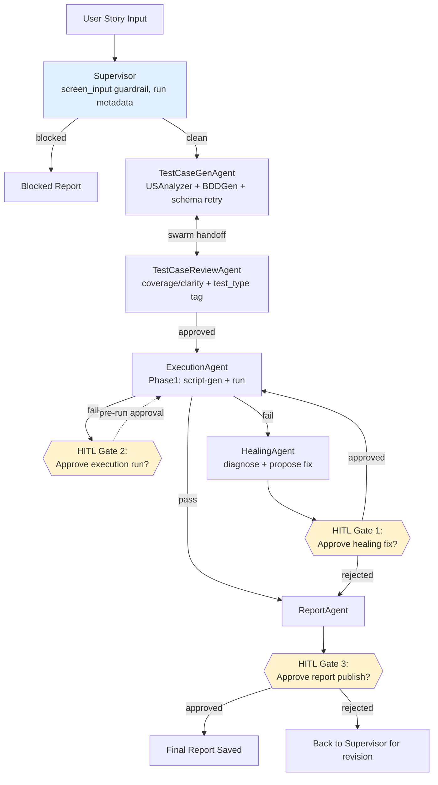
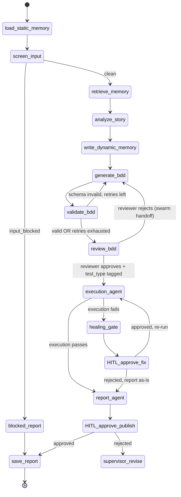
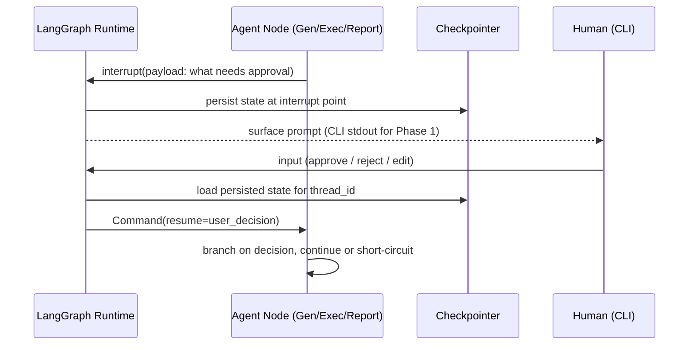

## About This Document

This is a public design artifact for QAWorkflow, an open-source multi-agent AI test automation system. It's part of a portfolio demonstrating architecture design, documentation practices, and agentic AI patterns for QA.

**If you're interested in training, consulting, or architecture guidance on similar systems, reach out  [iitd.shalinia@gmail.com][+91-6281300957].**

# QAWorkflow — Multi-Agent AI Test Automation System
### PRD + Technical Design Doc
**Owner:** Shalini Agarwal | **Status:** Draft v2 | **Last updated:** 2026-09-01

---

## 1. Background

QAWorkflow began as a single LangGraph pipeline: retrieve context → analyze user story → generate BDD test cases → validate → review → report. It already has working input/output guardrails, observability (LangSmith-ready), a vector-memory layer (ChromaDB), and a checkpointer skeleton for multi-turn state.


 The goal: from *generating* test artifacts to *closing the loop* — generate → execute → self-heal → report — with human oversight at the points where automation shouldn't act unilaterally.

## 2. Goals

- Demonstrate a genuine multi-agent architecture (hybrid supervisor + swarm), not a single linear chain
- Close the loop from test generation to execution to reporting, without a human manually translating cases into scripts
- Build defensible self-healing that a human can audit and approve, not a silent black box
- Produce an architecture that generalizes: same core loop supports scripted execution now and scriptless/live execution later, without a redesign
- Produce documentation artifacts (this doc, diagrams) suitable for a GitHub portfolio and for a Test Architect-track conversation

## 3. Non-goals (explicitly out of scope for now)

- Live/scriptless execution (Phase 2)
- Jira/Xray integration, in either direction (Phase 3)
- Production-grade auth/security hardening of the approval mechanism (CLI stub is fine for now)
- Multi-user concurrent runs

## 4. Scope & Phasing

| Phase | Scope |
|---|---|
| **Phase 1** (this doc, build now) | Supervisor + swarm refactor, TestCaseGenAgent, TestCaseReviewAgent, ExecutionAgent (scripted), HealingAgent, ReportAgent, HITL at 3 gates, **CLI-based approval only** |
| **Phase 2** | Replace ExecutionAgent's script-generate-then-run with live/scriptless tool-calling execution (Playwright MCP, step-by-step against current DOM); redefine HealingAgent's trigger conditions for live failures; configurable execution mode (cache for smoke/regression, live for sanity/exploratory); **HITL wired into app.py; LangGraph Studio integration; mcp_server.py updated to support HITL over MCP** |
| **Phase 3** | Jira/Xray integration — pull user stories in as workflow input; publish final report back to Jira/Xray on completion |

## 5. Success Criteria

- A user story goes in; a reviewed, tagged, executed, (self-healed where applicable), human-approved report comes out — with zero manual script-writing
- Each of the 3 HITL gates correctly pauses the graph and resumes from the same state after approval (proven via checkpointer, not a restart)
- Architecture and routing decisions are documented well enough that they can be explained and defended.

---

## 6. Architecture

### 6.1 Agent Roster & Pattern per Edge

| Agent | Role | Edge type in/out |
|---|---|---|
| **Supervisor** | Entry point. Owns `screen_input` guardrail, run metadata (run_id, timestamps), initial dispatch | Supervisor-routed (in), hands off (out) |
| **TestCaseGenAgent** | Wraps USAnalyzer → BDDGen → schema-validate/retry loop | Swarm (peer handoff to/from Review) |
| **TestCaseReviewAgent** | Qualitative review (coverage/clarity) + assigns `test_type` tag (smoke/regression/sanity/exploratory) | Swarm — hands off directly back to TestCaseGenAgent on fail, or forward to Execution on pass |
| **ExecutionAgent** | Phase 1: generates a script from BDD case and runs it. Phase 2: live tool-calling execution | Swarm handoff to Healing (on failure) or Report (on pass) |
| **HealingAgent** | Diagnoses execution failures, proposes a fix, **requests HITL approval**, re-runs via Execution | Swarm; loops back to ExecutionAgent |
| **ReportAgent** | Aggregates results + healing actions into final report, **requests HITL approval before publishing** | Swarm → END |

**Why hybrid, not pure supervisor or pure swarm:** Supervisor is reserved for genuine dispatch decisions (which flow starts, holding shared run metadata, input validation). Every other transition is "this agent's own output determines the next agent" — a peer decision, not a routing decision — so it's modeled as swarm. Routing every hop through a central node would add cost (state round-trip, possibly an extra LLM call) for a decision that doesn't need central arbitration.

**How swarm handoffs are decided:** given the local model in use (see Section 12 — Risks), handoff decisions are **code-based, not LLM-tool-call-based**. Each agent's LLM call produces content (a BDD case, a review verdict, a healing proposal); a Python function inspects that output (pass/fail flags, schema validity) and decides the next hop — the model itself never emits a routing tool call (e.g. `transfer_to_bdd_gen`). This is still genuinely swarm — a peer handoff, no central dispatcher arbitrating — the decision mechanism is just deterministic rather than model-driven, which is the more reliable choice at this model scale. This mirrors the existing `validate_bdd` → `route_after_validate_bdd` pattern already in the codebase, extended to the new agents.

**Safety nets on swarm:** `recursion_limit` set at graph level; a `max_hops` counter carried in shared state as a second guard against runaway peer-handoff loops (e.g., Review ↔ Gen cycling indefinitely).

### 6.2 System Architecture Diagram



### 6.3 State Transition Diagram

Captures the actual node-level routing, including existing retry loops carried over from the current `workflow.py`.



### 6.4 HITL Sequence Diagram — Phase 1 (CLI)

All 3 gates use the same underlying mechanism: LangGraph's `interrupt()` inside a node, resumed via `Command(resume=...)` against the same `thread_id`, backed by the existing checkpointer (the graph already has `MemorySaver` wired for multi-turn runs — HITL reuses that, doesn't need a new mechanism). Since the workflow is run from the CLI in Phase 1, approval is surfaced on the CLI too — there's no separate UI yet for it to live in.



**The 3 gates, concretely:**

1. **Before ExecutionAgent runs tests** — pause after TestCaseReviewAgent approves, before any script is generated/run. Human confirms it's safe to execute against the target app.
2. **Before HealingAgent applies a fix** — pause after HealingAgent proposes a fix, before it patches and re-runs. This is the highest-value gate from an SDET standpoint: an auto-applied fix on a *regression* suite could be silently masking a real bug rather than a flaky selector — a human call is warranted, not automation.
3. **Before final report is published** — pause after ReportAgent assembles the report, before `save_report` (and, in Phase 3, before it's pushed to Jira/Xray). Human gets final sign-off before anything leaves the system.

---

## 7. State Schema (extension to existing `QAState`)

```python
class QAState(TypedDict, total=False):
    # ...existing fields (user_story, static_memory, dynamic_memory,
    # analysis, bdd_cases, review_notes, final_report, retrieved_context,
    # output_path, input_blocked, block_reason, bdd_valid, retry_count)

    # New — Phase 1
    test_type: str              # smoke | regression | sanity | exploratory
    execution_result: str       # pass | fail
    execution_log: str          # captured output/errors from script run
    healing_proposed: str       # description of proposed fix
    healing_applied: bool
    hitl_gate: str              # which gate is currently pending, if any
    hitl_decision: str          # approve | reject | edit
    run_id: str                 # stamped once by Supervisor
    hops: int                   # swarm loop safety counter
```

## 8. Test Case Bucketing (feeds Phase 2/3, designed now)

Assigned by TestCaseReviewAgent alongside its qualitative review pass — rule-based first, LLM as tiebreaker only when history is ambiguous:

| Type | Rule | Execution mode (Phase 2/3) |
|---|---|---|
| Smoke | Critical-path flow, run every build | Cache |
| Regression | Previously-covered flow, repeated to catch drift | Cache (cache-miss = signal, not just "heal and move on") |
| Sanity | Narrow, ad hoc, verifies a specific fix | Live |
| Exploratory | No fixed path, first-time coverage | Live (nothing to cache) |

---

## 9. Phase 2 Design — Grounding Test Generation in Reality, and What HITL Needs to Become

### 9.0 Problem Statement, With Evidence

Phase 1's `ExecutionAgent` generates a pytest-playwright script from BDD text alone — no knowledge of the actual target page's DOM. Running it against the real site (`https://shaliniaiitd.github.io`, story `projects_1`) produced 7 failures out of 9 tests. Categorizing the actual failures:

| Failure type | Example from this run | Root cause |
|---|---|---|
| **Selector guessing** | `locator("text=Home")` not found; `.project-card` count 0; `button.hamburger` not found | LLM invented plausible-sounding selectors for "a typical portfolio site," with zero knowledge of the real DOM |
| **False positive** | LinkedIn URL returned HTTP `999` → treated as broken | LinkedIn deliberately returns `999` to block automated/bot requests — not a real link failure, but the test has no way to know that |
| **Ungrounded invented scenario** | "No deleted GitHub repo link found," "No certificate link points to 404" | LLM imagined plausible *negative* test scenarios with no way to verify whether such a case actually exists on the real site |
| **Possibly genuine finding** | Image with empty `alt` text | One failure that may reflect a real, worth-fixing issue — the one category where ungrounded generation still adds value |

**The pattern:** roughly 1 in 3 generated assertions is a legitimate finding or a fair test; the rest are artifacts of the model never having seen the actual page. This isn't a prompt-wording problem — it's structural. No amount of prompt engineering fixes "the model doesn't know what's actually on the page."

### 9.1 Two-Part Fix: 2a (grounded generation) now, 2b (live execution) as the fuller solution

Rather than jumping straight to the full live/scriptless rebuild, split Phase 2 into two increments — each independently demoable, and together they tell a clean "before → partial fix → full fix" portfolio story:

**Phase 2a — DOM-grounded script generation (smaller, immediate)**
Scripts are still generated ahead of time (static, like Phase 1), but the codegen prompt is no longer blind. Before calling the LLM:
1. **Scan the real target page** — fetch `TARGET_APP_URL` via Playwright (or a lightweight HTTP + BeautifulSoup pass) and extract structural facts: actual nav link text, real class names on key elements, actual `` alt-text state, real external links present on the page.
2. **Feed that structural summary into the codegen prompt** alongside the BDD cases — replacing "here's a URL, guess the DOM" with "here's a URL and here's what's actually on it."
3. **Special-case known bot-blocking domains** (LinkedIn `999`, similar patterns) in the codegen instructions, so external-link checks don't misreport intentional anti-scraping responses as broken links.
4. **Constrain invented negative scenarios** — TestCaseReviewAgent flags BDD cases that assert the *absence* of something unverifiable (a "deleted repo," a "404 certificate") as speculative, and either drops them or routes them to a human-reviewable list rather than generating a script assertion for something that may not exist.

This directly fixes the selector-guessing and false-positive categories (the majority of today's failures) without requiring live tool-calling infrastructure.

**Phase 2b — Live/scriptless execution (bigger, the original Phase 2 vision, still deferred)**
ExecutionAgent's job becomes: interpret each BDD step live against the *current* DOM (Playwright MCP tool calls), no intermediate script file. This is the fuller fix — resilient to drift *between* runs, not just accurate at generation time — but it's a bigger lift (agent loop, tool-calling infrastructure, MCP wiring) and 2a alone resolves most of what today's evidence shows. Sections 9.2–9.4 below (HITL in app.py, LangGraph Studio, MCP HITL) remain scoped to this fuller phase, unchanged from the original plan.

### 9.1.1 Phasewise Artifact Organization

To make the "what did each phase actually fix" story demonstrable rather than just claimed, scripts and results are kept **separated by phase**, not overwritten in place:

```
tests/
  phase1/            # ungrounded generation -- kept as-is, the "before" baseline
    test_projects_1.py
    ...
  phase2/            # DOM-grounded generation (2a) and later live execution (2b)
    test_projects_1.py
    ...
outputs/test_results/
  phase1/
    projects_1.log
  phase2/
    projects_1.log
```

Phase 1 code (`generate_script_for_story`, `execution_agent`, `_run_pytest_script`) writes under the `phase1/` subfolder; Phase 2 code (once built) writes under `phase2/`, using the *same* story ID so a single story's before/after logs and scripts sit side by side for direct comparison.

### 9.2 HITL in app.py

Phase 1's CLI `input()` prompts are replaced with an approval UI surfaced through `app.py` (FastAPI backend) and the React/Vite frontend — the interrupt payload (what needs approving, at which gate) is returned to the frontend instead of printed to stdout, and the resume decision comes back as an API call instead of a keypress. The underlying `interrupt()`/`Command(resume=...)`/checkpointer mechanism from Section 6.4 doesn't change — only what triggers the resume changes.

### 9.3 LangGraph Studio

Worth being precise about what this is and isn't, since it's easy to conflate with LangSmith: **LangSmith is observability** — a passive trace viewer, including where a run paused at an interrupt, but not an interactive approve/resume UI. **LangGraph Studio is a separate tool** that gives a live, visual UI for a running graph — you can see a paused interrupt and resume it with a decision directly in the Studio UI, no custom frontend code needed for that interaction. It requires a `langgraph.json` manifest and running via `langgraph dev` — WealthDesk already has this set up; QAWorkflow does not yet. Adding Studio support in Phase 2 means:
- Add `langgraph.json` pointing at the compiled graph
- Confirm the graph runs under `langgraph dev`
- HITL gates become approvable/rejectable directly from the Studio UI, as an alternative to the app.py-based approval flow — useful for debugging/demoing without needing the full frontend running

This is additive, not a replacement for 9.2 — app.py is the "real" user-facing approval path; Studio is the "developer inspecting/demoing a specific run" path.

### 9.4 HITL over MCP (mcp_server.py)

This needs a structurally different approach from the other two, because MCP tool calls are stateless request/response — a tool invocation can't block indefinitely waiting on a human decision the way a CLI script or a long-lived app.py session can. The pattern:

- The existing "run workflow" MCP tool, when it hits an `interrupt()`, **returns** the interrupt payload + `thread_id` as its tool result, instead of blocking
- A **new, second MCP tool** (e.g. `resume_workflow`) is added, taking `thread_id` + the human's decision, and calls `Command(resume=...)` against the checkpointer to continue the run
- In MCP Inspector, a human operator would: call the run tool → see the interrupt payload returned → call `resume_workflow` with their decision → repeat until the run completes

This is a genuine addition to `mcp_server.py` (a new tool, not a tweak to the existing one), scoped for Phase 2 alongside app.py and Studio work — Phase 1 stays CLI-only, no MCP-level HITL yet.

## 10. Phase 3 Preview — Jira/Xray Integration

- **Inbound:** pull user stories from Jira as workflow input (replaces manual `user_story` string entry)
- **Outbound:** publish ReportAgent's final report back to Jira/Xray after HITL Gate 3 approval — field mapping TBD when this phase starts, informed by ReportAgent's finalized output shape from Phase 1

---

## 11. Open Assumptions (flag if wrong)

- HITL Phase 1 interaction = CLI `input()` prompt only; app.py, LangGraph Studio, and MCP-level HITL are all Phase 2
- Rejecting the report at Gate 3 routes back to Supervisor for revision rather than terminating the run
- `test_type` tagging logic starts rule-based; LLM tiebreaker only for ambiguous history

---

## 12. Risks

### 12.1 Model capacity (`qwen2.5-coder:0.5b`)

The local model backing every node is small (0.5B parameters), and that has concrete architectural consequences beyond "answers might be lower quality":

- **Tool-calling / structured-output reliability.** A 0.5B model does not reliably produce consistent structured output (a clean JSON schema, or a well-formed tool call) on the first attempt — the existing `validate_bdd` retry loop is already evidence of this in practice, since the model doesn't reliably emit valid Gherkin structure on the first try. This risk compounds if the model is asked to make a *routing* decision via tool-calling: a malformed handoff doesn't just produce one bad test case, it can send the graph somewhere structurally wrong. **Mitigation:** Section 6.1's code-based swarm handoff decision — the model produces content, code decides the next hop, never the reverse.
- **Reasoning depth for judgment-heavy nodes.** HealingAgent's job ("diagnose why this failed, propose a fix") is qualitatively harder than schema-shaped generation (writing a BDD case). A 0.5B model may produce shallow or generic diagnoses where a larger model would reason more concretely about the actual failure. **Mitigation:** extend the existing guardrail pattern — validate `healing_proposed` output shape and specificity before acting on it, same retry-on-failure treatment `validate_bdd` already gets. If output quality proves insufficient once built and tested, consider a mixed-model setup: keep `qwen2.5-coder:0.5b` for cheap, schema-shaped generation (BDD writing), but point HealingAgent's diagnosis step at a larger local model via Ollama (e.g. a 7B variant) — Ollama makes per-call model swaps cheap, so this is a config change, not a redesign.
- **Long-context degradation.** Nodes that combine static memory + dynamic memory + retrieved context + user story into one prompt (`analyze_story`, `generate_bdd`) risk quality drop-off as that combined prompt grows, more so at 0.5B than at larger scale. **Mitigation:** watch prompt length as new agents are added; keep each agent's prompt scoped to only the state fields it actually needs (already partially enforced via `PROMPT_FIELDS`).
- **Validate before building around it.** Before writing HealingAgent's retry/guardrail logic, worth manually running a handful of representative diagnosis prompts against the 0.5B model to see whether this is a real problem to design around or a hypothetical one — empirical check is cheaper than architecting defensively against an untested assumption.

### 12.2 Static memory / context drift

**Discovered in practice, not anticipated in the original design:** `project_memory.json` (which feeds `static_memory`, injected into every `analyze_story`/`generate_bdd` prompt) started as a leftover "Auth Portal / password-reset" placeholder from an earlier tutorial exercise, while the actual user stories are generated from `data/portfolio_content.json` (a resume/portfolio site with no login functionality). The mismatch wasn't caught until HealingAgent produced diagnoses that made no sense ("update the login selector") for an app with no login page — the LLM was correctly following the context it was given, which was simply wrong for the actual target application.

**Lesson:** `static_memory` is a strong, unconditional prior injected into *every* prompt in the pipeline — stale or mismatched content there silently biases every downstream artifact (analysis, BDD cases, generated scripts, healing diagnoses) without producing any error, because nothing is technically invalid, just ungrounded. Worth periodically auditing `project_memory.json` against the actual target application whenever the target changes, and worth eventually adding a lightweight consistency check (e.g., does `static_memory`'s vocabulary overlap at all with the retrieved/generated content?) rather than relying on catching it downstream via a confused HealingAgent output.

### 12.3 Simulating failures to actually test HealingAgent (deferred to Phase 2)

HealingAgent's rule-based diagnosis (Section on HealingAgent, `_diagnose_failure_pattern`) has only been exercised against whatever failures happen to occur naturally (e.g., the Auth Portal mismatch above). To properly validate the healer, failures need to be **deliberately and reproducibly induced** rather than waited for:

- **Locator drift** — intentionally rename a class/id/data-testid in a test target page (or point the test at a modified copy of the page) between test generation and execution, to trigger the selector-not-found pattern on demand
- **Flakiness** — inject artificial randomness into element visibility/timing (e.g., a test fixture page with a randomized render delay) to trigger the timeout/wait pattern reproducibly
- **Network delays** — use Playwright's built-in network throttling/route interception to simulate slow responses
- **429 / rate limiting** — use Playwright route interception to mock a 429 response from a target endpoint and verify HealingAgent's diagnosis correctly identifies it as distinct from a generic navigation failure (current rule-based patterns don't have a specific 429/rate-limit branch yet — worth adding when this is tackled)

This is real test infrastructure in its own right (a fault-injection harness), not a quick addition — noting it here as a concrete Phase 2 item rather than building it now, since Phase 1's priority is proving the end-to-end loop works, not yet proving the healer is good.
